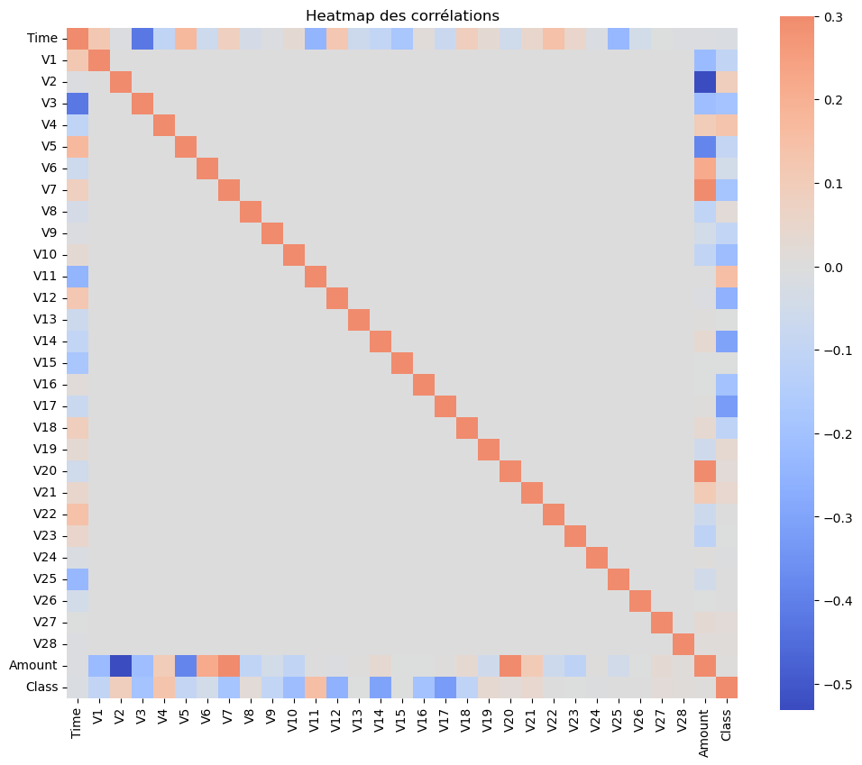

# Rapport d’exploration – EagleEye Fraud

## Points-clés

- Le dataset est très déséquilibré (0.17% de fraudes)
- Les fraudes ont tendance à concerner des montants légèrement plus élevés (à vérifier selon les plots)
- Certaines variables (ex : V14, V17, V12…) montrent des différences de distribution marquées entre fraudes et non-fraudes
- Prochaines étapes : modélisation en tenant compte du déséquilibre, feature selection possible sur les variables les plus pertinentes

## Visualisations clés

[Inclure quelques captures de tes meilleurs graphiques]

## Variables potentiellement pertinentes pour la détection

## Analyse des corrélations avec la variable cible (fraude)

La heatmap des corrélations montre que :

- Les variables les plus corrélées avec la fraude (‘Class’) sont : V17 (0.33), V14 (0.30), V12 (0.26), V10 (0.22), V16 (0.20), V3 (0.19), V7 (0.19), V11 (0.15), V4 (0.13).
- Ces valeurs indiquent une corrélation modérée ; aucune variable n’explique seule la fraude.
- Les variables ‘Amount’ et ‘Time’ n’apportent que peu de signal direct pour détecter les fraudes.
- Il sera pertinent de surveiller l’importance de ces variables lors de la modélisation (feature importance).
- La combinaison de ces variables par un algorithme de Machine Learning permettra d’améliorer la détection.

**Conclusion :**
Pour la modélisation, il faudra privilégier les algorithmes capables de capter les interactions entre variables. Une sélection des features (V17, V14, V12, V10, etc.) pourra être envisagée pour des modèles simples, mais la plupart des modèles utiliseront toutes les variables disponibles.
