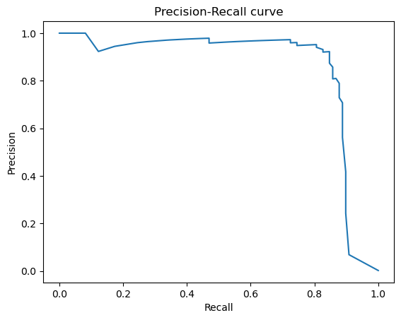

# Rapport de Modélisation – EagleEye Fraud

**Projet :** EagleEye Fraud  
**Sprint :** 2  
**US3 :** Modéliser la détection de fraude  
**Auteur :** Josué
**Date :** 03/06/2025

---

## 1. Objectif

Développer, entraîner et évaluer des modèles de machine learning pour détecter automatiquement les transactions bancaires frauduleuses, tout en gérant le fort déséquilibre du dataset.

---

## 2. Méthodologie

- **Données utilisées** : `creditcard_clean.csv` (nettoyé au Sprint 1)
- **Séparation train/test** : 80 % entraînement, 20 % test, stratifié sur la variable cible
- **Variables d’entrée** : V1 à V28 (PCA), 'Time', 'Amount'
- **Variable cible** : `Class` (1 = fraude, 0 = normal)
- **Gestion du déséquilibre** :
  - RandomForest avec `class_weight='balanced'`
  - XGBoost avec `scale_pos_weight`

---

## 3. Modèles testés et résultats

### **Tableau comparatif des performances sur le jeu de test**

| Modèle         | Recall (fraude) | Precision (fraude) | F1-score (fraude) | ROC AUC | AUPRC |
|----------------|-----------------|--------------------|-------------------|---------|-------|
| RandomForest   |     0.74        |      0.96          |      0.84         | 0.95    | 0.85  |
| XGBoost        |     0.84        |      0.88          |      0.86         | 0.97    | 0.88  |

---

### **Matrice de confusion (XGBoost)**

|                 | Prédit non-fraude | Prédit fraude |
|-----------------|:-----------------:|:-------------:|
| **Réel non-fraude** |      56 853      |     11        |
| **Réel fraude**     |      16          |     82        |

---

### **Courbe Precision-Recall**

- **AUPRC obtenu (XGBoost)** : **0.88**
- Le modèle est largement supérieur au hasard (baseline ≈ 0.0017 pour ce dataset).

---

## 4. Analyse et choix du modèle

- **RandomForest** : très grande précision sur les fraudes (96 %), mais un rappel de 74 % (25 fraudes non détectées).
- **XGBoost** : meilleur compromis, rappel élevé (84 %) tout en maintenant une bonne précision (88 %) et un F1-score supérieur (0.86).
- **ROC AUC et AUPRC** : XGBoost légèrement supérieur à RandomForest, ce qui confirme la qualité du modèle.

**Choix final** :  
Nous retenons le modèle **XGBoost** pour la suite du projet, car il maximise le rappel (plus de fraudes détectées) tout en conservant une précision élevée et une excellente performance globale sur toutes les métriques pertinentes pour un contexte de classe déséquilibrée.

---

## 5. Limites et pistes d’amélioration

- Le modèle XGBoost génère un peu plus de faux positifs que RandomForest (11 vs 3), mais il détecte nettement plus de fraudes (82 vs 73).
- Pour aller plus loin :
  - Tester le suréchantillonnage (SMOTE) pour améliorer le rappel.
  - Ajuster le seuil de classification pour un compromis optimal.
  - Optimiser les hyperparamètres (GridSearch/RandomizedSearch).
  - Ajouter des analyses de coût (coût des faux négatifs/faux positifs) pour coller à la réalité métier.

---

## 6. Conclusion

Le modèle XGBoost permet d’identifier 84 % des fraudes, avec une précision de 88 % et très peu de fausses alertes, ce qui le rend très adapté à une utilisation opérationnelle. Il sera utilisé pour alimenter le reporting, la génération d’alertes et l’intégration dans le process de gestion de fraude du projet EagleEye Fraud.

---

*Fichier généré à l’issue du Sprint 2. Résultats reproductibles, code et artefacts disponibles dans le dossier du projet.*

## 7. Axes d’amélioration avancés

- Hyperparameter optimization
- Threshold tuning
- Class imbalance handling (SMOTE)
- Stratified cross-validation
- Feature importance analysis
- Alternative models tested
- Business cost analysis
- Local model explainability (SHAP/LIME)
